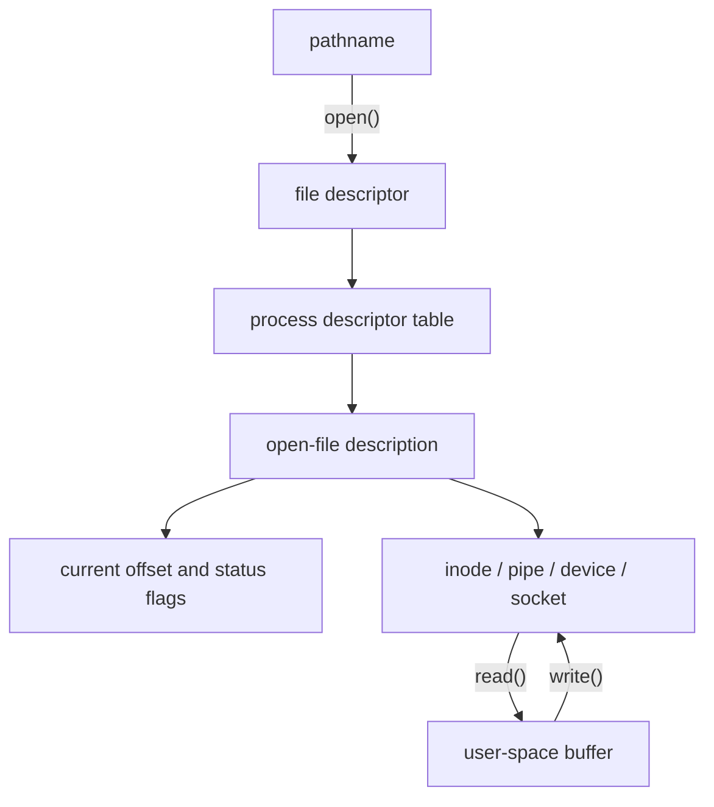
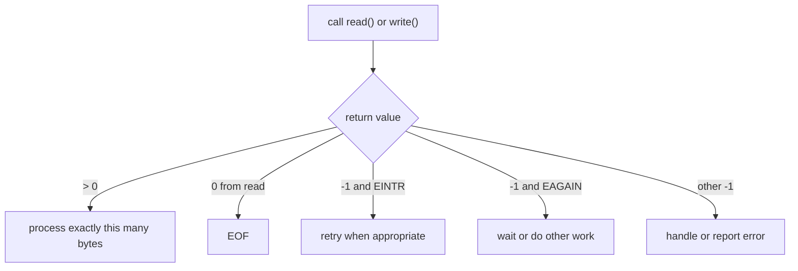

# Chapter 2 mental map — Linux file I/O

## The central path

## What lives where

| User space controls | Kernel controls |
|---|---|
| pathname supplied to `open()` | pathname resolution and permission checks |
| access and status flags requested | process descriptor table |
| memory address and byte count | open-file description and current offset |
| handling of return values and `errno` | copying between kernel and user buffers |
| retry policy for `EINTR`/`EAGAIN` | page cache, writeback, filesystem, and devices |
| when to call `fsync()` and `close()` | readiness and blocking behavior |

## Operation effects

| Operation | Uses pathname? | Uses descriptor? | Changes normal offset? | Durability promise? |
|---|---:|---:|---:|---:|
| `open()` | yes | returns one | initializes it | no |
| `read()` | no | yes | yes | not applicable |
| `write()` | no | yes | yes | normally no |
| `lseek()` | no | yes | yes | no |
| `pread()` | no | yes | no | not applicable |
| `pwrite()` | no | yes | no | normally no |
| `ftruncate()` | no | yes | no | normally no |
| `fdatasync()` | no | yes | no | data plus required metadata |
| `fsync()` | no | yes | no | file data and metadata |
| `close()` | no | consumes one | descriptor becomes invalid | no independent guarantee |
| `select()` | no | watches many | no | not applicable |

## Return-value decision tree

## The sentence to remember

> Read the return value first; only then decide what the descriptor, buffer, or
> bytes mean.
