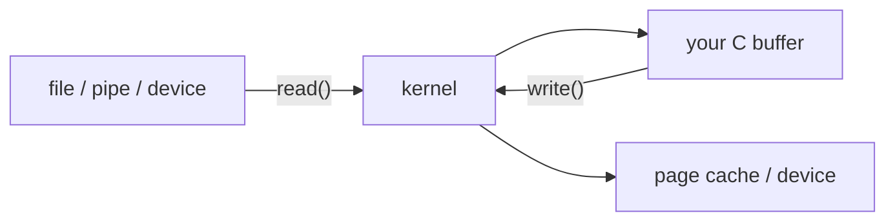

# Linux System Programming — Chapter 2, pages 31–61

## A runnable study guide to basic file I/O

This guide covers the middle of Chapter 2, **File I/O**, in Robert Love's *Linux
System Programming*, Second Edition. The page range begins during the discussion
of `open()` flags and reaches the introduction to `pselect()`.

The goal is not to memorize function names. The goal is to build one mental model:

> Your C program owns memory; the kernel owns open-file state and performs I/O.
> A file descriptor is the small integer your process uses to refer to that kernel
> state.

Every referenced file in `exercises/` and `experiments/` is a complete,
standalone C program. Nothing is left as a fragment for you to guess. The
programs compile with the repository's strict warning policy and are tested on
Linux.

## What these pages cover

| Pages | Main ideas |
|---|---|
| 31–32 | `open()` access modes and flags such as `O_APPEND`, `O_CREAT`, `O_EXCL`, `O_NONBLOCK`, `O_SYNC`, and `O_TRUNC` |
| 33–35 | Ownership, requested permissions, `umask`, `creat()`, and `open()` errors |
| 36–40 | `read()`, return values, EOF, short reads, interruption, nonblocking reads, errors, and size limits |
| 40–44 | `write()`, partial writes, append mode, nonblocking writes, errors, and delayed-write behavior |
| 45–49 | `fsync()`, `fdatasync()`, `sync()`, synchronized flags, and direct I/O |
| 50 | `close()` behavior and errors |
| 51–52 | `lseek()`, file positions, seeking past EOF, and sparse-file holes |
| 53–55 | `pread()`, `pwrite()`, `truncate()`, and `ftruncate()` |
| 55–60 | Why multiplexed I/O is needed and how `select()` works |
| 60–61 | The purpose of `pselect()` and how it differs from `select()` |

## Set up the lab

From the root of the existing repository, build and test Chapter 2:

```bash
cd ~/linux_system_programming_lab
make chapter CHAPTER=02
make test CHAPTER=02
```

The root `Makefile` compiles every Chapter 2 program separately with the
repository's strict Clang flags:

```bash
clang -std=c17 -Wall -Wextra -Wpedantic -Wconversion -Wshadow \
      -Wformat=2 -Wundef -g3 -O0 PROGRAM.c -o PROGRAM
```

To rebuild with AddressSanitizer and UndefinedBehaviorSanitizer:

```bash
make sanitize
```

To remove binaries and files created by the demonstrations:

```bash
make clean
```

## 1. The chapter's central model

### A pathname and a file descriptor are not the same thing

A pathname such as `notes.txt` is a name used to locate a filesystem object.
`open()` asks the kernel to resolve that pathname, check permissions, create an
open-file entry, and return a file descriptor.

After that, `read()`, `write()`, `lseek()`, `fsync()`, and `close()` operate on the
descriptor—not on the pathname.


The kernel's open-file state includes the current file position and status flags.
That explains why one `read()` normally begins where the previous `read()` ended.

Important facts:

- A valid descriptor is any nonnegative `int` returned by a successful operation.
- `-1` signals failure from `open()` and many related calls; inspect `errno` only
  after a call reports failure.
- Descriptors `0`, `1`, and `2` conventionally mean standard input, standard output,
  and standard error.
- `open()` normally returns the lowest unused descriptor. `3` is common in a tiny
  program, but production code must never assume it.
- A descriptor number is meaningful only inside the process that owns it.
- A descriptor may refer to a regular file, terminal, pipe, socket, device, or other
  kernel object. This is a practical meaning of Unix's “everything is a file” idea.
- Once closed, the number can be reused for a different open object.

### What a buffer means here

A buffer is simply a region of your process's memory used to hold bytes while data
moves between user space and the kernel.

For `read(fd, buffer, count)`, `buffer` is the destination. For
`write(fd, buffer, count)`, it is the source. The system calls work with bytes, not C
strings. A successful `read()` does not add a terminating `\0`.



This distinction prevents a common bug: after reading `n` bytes, do not pass the
buffer to `%s` unless you deliberately reserved another byte and stored `\0` there.
For arbitrary data, use the returned byte count.

## 2. `open()`: access mode, behavior flags, and creation

The basic forms are:

```c
int open(const char *path, int flags);
int open(const char *path, int flags, mode_t mode);
```

Use the three-argument form when `O_CREAT` may create a file. The third argument is
otherwise ignored.

Choose exactly one access mode:

| Access mode | Meaning |
|---|---|
| `O_RDONLY` | Allow reads |
| `O_WRONLY` | Allow writes |
| `O_RDWR` | Allow both |

Combine the access mode with behavior flags using bitwise OR (`|`):

| Flag | Plain-language effect | Main caution |
|---|---|---|
| `O_CREAT` | Create the file if missing | Supply the `mode` argument |
| `O_EXCL` with `O_CREAT` | Fail if the name already exists | Useful for race-free exclusive creation |
| `O_TRUNC` | Set an existing regular file's length to zero | Can destroy all existing content immediately |
| `O_APPEND` | Kernel positions each write at the current end | Safer than a separate seek-then-write sequence |
| `O_NONBLOCK` | Return rather than waiting when an operation would block | Expect `EAGAIN` or `EWOULDBLOCK` |
| `O_CLOEXEC` | Close the descriptor during a successful `exec` | Helps prevent descriptor leaks into new programs |
| `O_SYNC` | Make writes wait for synchronized completion | Much slower than normal cached writes |
| `O_DIRECTORY` | Require the target to be a directory | Linux-specific |
| `O_NOFOLLOW` | Reject a final pathname component that is a symbolic link | Useful in defensive pathname handling |
| `O_DIRECT` | Attempt to bypass normal page-cache buffering | Alignment and filesystem restrictions apply |

`creat(path, mode)` is an old convenience equivalent to opening with
`O_WRONLY | O_CREAT | O_TRUNC`. Modern code can usually use `open()` directly because
it makes the behavior more obvious.

### Lab 1 — descriptor lifecycle

Complete program: [`experiments/fd_reuse.c`](../experiments/fd_reuse.c)

Run it:

```bash
./build/chapters/02-file-io/experiments/fd_reuse
```

Typical output:

```text
standard descriptors: stdin=0 stdout=1 stderr=2
written through file descriptor 1 (stdout)
first open returned fd=3 (often 3 in a simple process)
next open returned fd=3; Linux may reuse a closed number
```

What Linux did:

- `write(STDOUT_FILENO, ...)` sent bytes through descriptor `1` without `printf()`.
- The first `open()` received the lowest currently unused descriptor.
- `close()` removed that descriptor from the process table.
- The next `open()` was allowed to reuse the old number. The integer is a handle, not
  a permanent identity for a file.

Try redirection:

```bash
./build/chapters/02-file-io/experiments/fd_reuse > redirected.txt
cat redirected.txt
```

The program still writes to descriptor `1`; the shell changed what descriptor `1`
refers to before starting the program.

### Lab 2 — `O_EXCL`, `O_APPEND`, and `O_TRUNC`

Complete program: [`experiments/open_flags.c`](../experiments/open_flags.c)

```bash
./build/chapters/02-file-io/experiments/open_flags
```

Expected output:

```text
O_CREAT | O_EXCL created the file once.
A second exclusive create failed with EEXIST, as expected.

After O_APPEND write:
original
appended despite seeking to offset zero

After O_TRUNC write:
replacement after O_TRUNC
```

The important detail is the append step. The program deliberately calls
`lseek(fd, 0, SEEK_SET)`, but `O_APPEND` still causes the subsequent write to go to
the end. With append mode, the kernel performs the end-positioning as part of the
write operation. A manual `lseek(fd, 0, SEEK_END)` followed by `write()` leaves a race
window in which another writer can change the file.

The final open uses `O_TRUNC`; the old data disappears as part of the successful
open, before the replacement write occurs.

Observe the real system calls:

```bash
strace -e trace=openat,read,write,lseek,close,unlink ./build/chapters/02-file-io/experiments/open_flags
```

On a modern glibc system, an `open()` call in the C source may appear as `openat()` in
`strace`. That is a library implementation detail; the descriptor behavior remains
the same.

## 3. New-file permissions and `umask`

The `mode` passed with `O_CREAT` is a request. The process's `umask` removes
permission bits:

```text
actual permissions = requested mode & ~umask
```

With requested mode `0666` and umask `0022`, the ordinary result is `0644`:

- owner: read and write;
- group: read;
- others: read.

There are no execute bits because the request did not contain them. A default ACL can
also affect the final result on some filesystems.

### Lab 3 — see `umask` change the request

Complete program: [`experiments/permissions_umask.c`](../experiments/permissions_umask.c)

```bash
./build/chapters/02-file-io/experiments/permissions_umask
stat -c '%A %a %n' build/chapters/02-file-io/data/permissions_demo.txt
```

Expected program output:

```text
requested mode: 0666
process umask:  0022
actual mode:    0644
mode after reopening with 0600: 0644
The mode argument is used only when open() actually creates the file.
```

The second `open()` requests `0600`, but the file already exists. `open()` does not
use that mode to change existing permissions. Use `chmod()` or `fchmod()` when you
intend to change them.

The new file's owner is normally the process's effective user ID. Group ownership can
depend on the parent directory and its set-group-ID bit.

## 4. `read()`: bytes, short reads, EOF, and blocking

The interface is:

```c
ssize_t read(int fd, void *buffer, size_t count);
```

Read the return value before interpreting the buffer:

| Return value | Meaning | Correct reaction |
|---|---|---|
| `> 0` | This many bytes were copied into your buffer | Process exactly that many bytes |
| `0` | End of file, or the writing side of a stream has closed | Stop the normal read loop |
| `-1`, `errno == EINTR` | A signal interrupted the call before data arrived | Usually retry |
| `-1`, `errno == EAGAIN` or `EWOULDBLOCK` | Nonblocking descriptor has no data now | Do other work or wait for readiness |
| `-1`, other error | Operation failed | Report or handle the specific error |

A positive result smaller than `count` is a successful short read. Short reads are
normal for pipes, terminals, sockets, end-of-file boundaries, and interrupted or
otherwise constrained transfers. A program that needs a fixed total must loop and
advance both its memory pointer and remaining byte count.

Do not use `size_t` to store the result of `read()`. `size_t` cannot represent `-1`.
Use `ssize_t`.

## 5. `write()`: completion is not durability

The interface is:

```c
ssize_t write(int fd, const void *buffer, size_t count);
```

A positive return value tells you how many bytes the kernel accepted. It may be less
than `count`, especially for pipes, sockets, devices, signals, resource limits, or a
full filesystem. Robust general-purpose code loops until all bytes are written.

The successful return of `write()` usually means the kernel copied the bytes out of
your user-space buffer. For a regular file, the bytes commonly enter the kernel's page
cache and are written to the storage device later. It does **not** by itself promise
survival after power loss.


### Lab 4 — a binary-safe, robust file copy

Complete program: [`exercises/08_robust_copy.c`](../exercises/08_robust_copy.c)

Create input, copy it, and verify byte-for-byte equality:

```bash
printf 'alpha\nbeta\n' > build/chapters/02-file-io/data/source.txt
./build/chapters/02-file-io/exercises/08_robust_copy build/chapters/02-file-io/data/source.txt build/chapters/02-file-io/data/copied.txt
cmp build/chapters/02-file-io/data/source.txt build/chapters/02-file-io/data/copied.txt
printf 'cmp exit status: %d\n' "$?"
```

Expected output:

```text
copied 11 bytes
cmp exit status: 0
```

Why this program matters:

- Its 4096-byte array is user-space memory, not the kernel page cache.
- It treats the data as arbitrary bytes, so it also works for images and executables.
- The outer loop continues until `read()` returns `0`.
- `EINTR` causes a retry.
- `write_all()` advances its pointer after every successful partial write.
- Both descriptors are closed on every path after they have been opened.
- `O_TRUNC` ensures an older, longer destination cannot leave stale bytes at the end.

Try it with a binary:

```bash
./build/chapters/02-file-io/exercises/08_robust_copy /bin/ls build/chapters/02-file-io/data/copied_ls
cmp /bin/ls build/chapters/02-file-io/data/copied_ls
file build/chapters/02-file-io/data/copied_ls
```

The copy lacks executable permission because it was created with mode `0644`; file
contents and file metadata are separate concerns.

### Lab 5 — nonblocking `read()` and `EAGAIN`

Complete program: [`experiments/nonblocking_pipe.c`](../experiments/nonblocking_pipe.c)

```bash
./build/chapters/02-file-io/experiments/nonblocking_pipe
```

Expected Linux output:

```text
before data: read returned -1, Resource temporarily unavailable
after data: read returned 5 bytes: hello
```

The pipe has a kernel buffer. Before anything is written, a normal `read()` would wait.
The program sets `O_NONBLOCK` on the read end, so Linux returns immediately with
`EAGAIN`. After five bytes enter the pipe, `read()` copies them into the C array and
returns `5`.

Nonblocking mode does not mean “the operation failed forever.” It means “the operation
cannot make progress right now without waiting.”

## 6. Synchronization and direct I/O

Choose the operation based on the guarantee you need:

| Operation | Practical meaning |
|---|---|
| normal `write()` | Return after the kernel accepts the bytes; writeback may be later |
| `fdatasync(fd)` | Synchronize file data plus metadata needed to retrieve that data |
| `fsync(fd)` | Synchronize file data and associated file metadata |
| `sync()` | Request writeback broadly across the system; not a precise per-operation tool |
| open with `O_SYNC` | Make each write use synchronized semantics; simple but potentially expensive |
| `O_DIRECT` | Attempt direct transfers with page-cache bypass and strict alignment rules |

Synchronization is about durability ordering, not merely visibility to another process.
Linux normally makes newly written cached data visible to later reads well before a
storage device has made it power-loss durable.

### Lab 6 — `fdatasync()`, `fsync()`, and directory durability

Complete program: [`experiments/durable_write.c`](../experiments/durable_write.c)

```bash
./build/chapters/02-file-io/experiments/durable_write
cat build/chapters/02-file-io/data/durable_record.txt
```

Expected output on a filesystem that supports directory synchronization:

```text
write() returned: bytes reached the kernel, not necessarily storage.
fdatasync() completed: file data and required metadata were requested to storage.
fsync() completed: file data and associated metadata were requested to storage.
fsync() completed for the containing directory entry.
payload synchronized with fdatasync()
payload synchronized with fsync()
```

Why synchronize the directory? Synchronizing the file does not necessarily make the
directory entry that gives the file its name durable. Programs such as databases and
package managers care about both. Some filesystems do not support `fsync()` on a
directory; this demo reports that condition without pretending it succeeded.

Also notice: `close()` is still called. `fsync()` does not release a descriptor, and
`close()` is not a substitute for `fsync()`.

### Lab 7 — optional `O_DIRECT` experiment

Complete program: [`experiments/direct_io.c`](../experiments/direct_io.c)

```bash
./build/chapters/02-file-io/experiments/direct_io
stat -c '%s bytes' build/chapters/02-file-io/data/direct_io_demo.bin
```

Expected output when the filesystem supports `O_DIRECT`:

```text
O_DIRECT write returned 4096 bytes using a 4096-byte aligned buffer.
4096 bytes
```

If the filesystem does not support this mode, the program explains that and exits with
status `2`. Direct I/O is intentionally an advanced experiment. The buffer address,
transfer size, and file offset may all have alignment restrictions. Bypassing the page
cache does not automatically make an application faster, and direct I/O is not the same
promise as synchronized I/O.

## 7. `close()` ends the descriptor relationship

The interface is:

```c
int close(int fd);
```

After a successful `close()`, the descriptor must be treated as invalid. The integer may
soon name something else if another `open()` reuses it. Closing the last reference can
also trigger object-specific cleanup—for example, an already-unlinked file can finally
be removed when its last open reference disappears.

Check the return value because delayed I/O errors can sometimes be reported at close.
On Linux, do not blindly retry `close()` after an error: the descriptor may already have
been released and reused in another thread. Treat the error as diagnostic and design
durability-sensitive code to use `fsync()` before closing.

## 8. File positions, `lseek()`, and sparse files

For a regular open file, the kernel maintains a current byte offset. A successful normal
`read()` or `write()` advances it by the number of bytes transferred.

```c
off_t lseek(int fd, off_t offset, int origin);
```

Origins:

| Origin | New position is based on |
|---|---|
| `SEEK_SET` | beginning of file |
| `SEEK_CUR` | current position |
| `SEEK_END` | current file length |

`lseek(fd, 0, SEEK_CUR)` reports the current position without deliberately moving it.
Pipes, FIFOs, and sockets do not have a seekable byte position; attempting to seek them
fails with `ESPIPE`.

Seeking past EOF does not immediately enlarge the file. If a later write occurs at the
distant position, the logical gap becomes a hole. Reads from the hole produce zero
bytes, while a hole-aware filesystem does not allocate storage blocks for the whole gap.

### Lab 8 — create and inspect a sparse file

Complete program: [`experiments/sparse_file.c`](../experiments/sparse_file.c)

```bash
./build/chapters/02-file-io/experiments/sparse_file
ls -lh build/chapters/02-file-io/data/sparse_demo.bin
du -h build/chapters/02-file-io/data/sparse_demo.bin
```

Typical output from the program:

```text
logical size: 1048579 bytes
allocated space reported by st_blocks: 8192 bytes
bytes read from the hole: 00 00 00 00 00 00 00 00
```

The logical size is exact: offset `1,048,576` plus the three bytes in `END`. Allocated
space varies with filesystem block size and implementation, so your number can differ.
The important result is that allocated space is much smaller than logical size.

Compare a sparse file with a fully allocated copy:

```bash
cp --sparse=never build/chapters/02-file-io/data/sparse_demo.bin build/chapters/02-file-io/data/full_demo.bin
ls -ls build/chapters/02-file-io/data/sparse_demo.bin build/chapters/02-file-io/data/full_demo.bin
```

## 9. Positional I/O: `pread()` and `pwrite()`

`pread()` and `pwrite()` transfer bytes at an explicit offset without changing the
open file description's current position. Conceptually, each combines positioning and
I/O in one operation.

This is especially useful when threads share an open file. A separate `lseek()` followed
by `read()` allows another thread to change the shared offset between those calls.
`pread()` names the desired offset directly.

### Lab 9 — prove that positional I/O preserves the offset

Complete program: [`exercises/10_positional_io.c`](../exercises/10_positional_io.c)

```bash
./build/chapters/02-file-io/exercises/10_positional_io
```

Expected output:

```text
pread(fd, 3 bytes, offset 4) -> "EFG"
shared offset: before=0 after pread=0 after pwrite=0
ordinary read from offset 0 -> "AxyzEFGHIJ"
```

The first normal write moved the current position to `10`; the program then reset it to
`0`. Both positional operations left it at `0`. Therefore the final ordinary `read()`
started at the beginning.

## 10. Truncating and extending a file

`truncate(path, length)` works through a pathname. `ftruncate(fd, length)` works through
an open descriptor. Shortening discards data beyond the new EOF. Extending produces a
logical zero-filled region. Neither operation moves the current file offset.

### Lab 10 — size changes do not move the offset

Complete program: [`exercises/11_truncate_file.c`](../exercises/11_truncate_file.c)

```bash
./build/chapters/02-file-io/exercises/11_truncate_file
```

Expected output:

```text
after shrinking: size=4, current offset=8
read at offset 8 after shrink returned 0 (EOF)
after extending to 12 bytes: 30 31 32 33 00 00 00 00 00 00 00 00
```

The hex values `30 31 32 33` are ASCII `0 1 2 3`. The eight zero bytes were created by
extending the file. The current offset remained `8` even though shrinking moved EOF to
`4`; therefore a read at that position immediately returned `0`.

## 11. Multiplexed I/O with `select()`

Blocking on one descriptor is a problem when a program must serve several independent
inputs. Busy-looping over nonblocking descriptors wastes CPU. `select()` lets the
process sleep until at least one watched descriptor becomes ready, a timeout expires,
or a signal interrupts the wait.

`select()` receives descriptor sets for readable, writable, and exceptional conditions.
The first argument is **one greater than the highest descriptor being watched**, not the
number of descriptors.

Before every call:

- clear a set with `FD_ZERO()`;
- add descriptors with `FD_SET()`;
- initialize the timeout;
- pass `max_fd + 1`;
- after return, use `FD_ISSET()` to see what is ready.

Both the descriptor sets and timeout can be modified by `select()`, so rebuild them
before calling it again in a loop.

Readiness means an operation can proceed without blocking. It does not always mean
ordinary payload exists. EOF and some error conditions also make a descriptor readable.

### Lab 11 — wait for terminal or piped input

Complete program: [`exercises/12_select_stdin.c`](../exercises/12_select_stdin.c)

Deterministic piped-input test:

```bash
printf 'ready\n' | ./build/chapters/02-file-io/exercises/12_select_stdin
```

Expected output:

```text
waiting up to 5 seconds for standard input...
stdin ready: read 6 bytes: ready
```

Interactive timeout test:

```bash
./build/chapters/02-file-io/exercises/12_select_stdin
```

Do not type anything for five seconds:

```text
waiting up to 5 seconds for standard input...
timeout: no input became ready
```

Run it again and type a line before five seconds expire. `select()` returns first, then
`read()` consumes the ready bytes.

### Where `pselect()` fits

`pselect()` expresses its timeout with `struct timespec` and can temporarily install a
signal mask while waiting. That allows a program to change the signal mask and begin
waiting as one atomic step, closing a race that can occur when separate signal-mask and
`select()` operations are used. Passing a null signal-mask pointer gives behavior close
to `select()` with a differently represented timeout.

## Common mistakes and how to reason about them

| Mistake | Why it is wrong | Better habit |
|---|---|---|
| Testing `if (!fd)` after `open()` | Descriptor `0` can be valid; failure is `-1` | Test `if (fd == -1)` |
| Assuming a new descriptor is `3` | Earlier opens or closed standard descriptors change the result | Store and use the returned value |
| Passing `O_CREAT` without a mode | The variadic third argument is required when creation occurs | Supply an explicit mode such as `0644` |
| Expecting mode `0666` to appear unchanged | `umask` and possibly default ACLs remove permissions | Inspect the actual result with `fstat()` |
| Opening with `O_TRUNC` before validation | Existing data can disappear immediately | Validate paths and intent before the destructive open |
| Calling `strlen()` on arbitrary file data | File bytes need not contain a terminator and may contain zeros | Use the byte count returned by `read()` |
| Printing a raw read buffer with `%s` | `read()` does not append `\0` | Use a precision or write exactly the returned count |
| Treating a short read as EOF | A short positive result is still data | Continue until `read()` returns `0` |
| Assuming `write()` transfers all bytes | Partial writes are legal | Loop, advancing pointer and reducing remaining count |
| Storing `read()`/`write()` result in `size_t` | Unsigned `size_t` cannot represent `-1` | Use `ssize_t` |
| Treating `EAGAIN` as permanent failure | It means the nonblocking operation would wait now | Wait for readiness or do other work |
| Seeking to EOF before every append | Seek and write are separate and can race | Open with `O_APPEND` |
| Expecting `close()` to guarantee durability | Closing releases a descriptor; cached writeback is separate | Use `fsync()`/`fdatasync()` when the guarantee matters |
| Retrying `close()` blindly | On Linux the number may already have been released and reused | Record the error; do not blindly close the number again |
| Calling `lseek()` on a pipe or socket | Streams do not have a seekable file offset | Expect `ESPIPE`; use stream-oriented logic |
| Forgetting `select()` changes its arguments | Reusing old sets/timeouts causes wrong behavior | Reinitialize them before each call |
| Passing a descriptor count to `select()` | The API wants highest descriptor plus one | Track `max_fd` and pass `max_fd + 1` |
| Assuming `O_DIRECT` is always faster | It shifts complexity to the application and imposes alignment rules | Benchmark a real workload before choosing it |

## Exercises for `linux_system_programming_lab`

Do these in order. Each exercise has a visible success condition.

### Foundation

1. **Descriptor redirection.** Run `fd_reuse` normally, then redirect standard
   output to a file. Add one direct `write()` to `STDERR_FILENO` and prove that `>`
   redirects stdout but not stderr. Success: you can explain which descriptor the shell
   changed.

2. **Access-mode failure.** Open a test file with `O_RDONLY`, deliberately call
   `write()`, and report `errno` with `perror()`. Success: you observe `EBADF` and the
   program closes the descriptor cleanly.

3. **Safe exclusive creation.** Modify `chapters/02-file-io/experiments/open_flags.c` so it does not unlink its old
   output. Run twice. Success: first run creates; second run refuses to overwrite and
   reports `EEXIST`.

4. **Three umasks.** Run a new-file experiment with umasks `0000`, `0022`, and `0077`
   while requesting `0666`. Predict each result before running. Success: actual modes
   match your bit-removal calculation.

### Core I/O

5. **Tiny-buffer copy.** Change `BUFFER_SIZE` in
   `chapters/02-file-io/exercises/08_robust_copy.c` to `1`, rebuild, and
   copy an executable. Success: `cmp` still returns `0`. Explain why correctness stays
   the same while syscall overhead grows.

6. **Count system calls.** Compare the 1-byte and 4096-byte copy versions using:

   ```bash
   strace -c ./build/chapters/02-file-io/exercises/08_robust_copy /bin/ls build/chapters/02-file-io/data/copied_ls
   ```

   Success: record the number of `read()` and `write()` calls for both buffer sizes.

7. **Read is not a string operation.** Create a 16-byte file containing embedded zero
   bytes, copy it, then inspect both with `od -An -tx1`. Success: the copied hex bytes
   are identical.

8. **Nonblocking retry without spinning.** Extend
   `chapters/02-file-io/experiments/nonblocking_pipe.c` so it uses
   `select()` after receiving `EAGAIN`, then writes from a child process after a short
   delay. Success: the parent sleeps in `select()` and reads only after readiness.

### File position and durability

9. **Offset notebook.** In one program, record `lseek(fd, 0, SEEK_CUR)` before and after
   two normal reads, one `pread()`, one normal write, and one `pwrite()`. Predict all six
   offsets first. Success: every measured value has a written explanation.

10. **Sparse versus full.** Create a 100 MiB sparse file and a fully allocated 100 MiB
    file. Compare `ls -lh`, `du -h`, `stat`, and creation time. Success: you can explain
    logical size versus allocated blocks.

11. **Misaligned direct I/O.** In
    `chapters/02-file-io/experiments/direct_io.c`, deliberately use an ordinary `malloc()`
    buffer or a 100-byte write. Success: on a filesystem enforcing the constraints, you
    capture `EINVAL`, then restore the aligned version. Filesystem behavior can vary, so
    document the environment as part of the result.

12. **Durable replacement pattern.** Create a new file, write and `fsync()` it, rename it
    over a target, then `fsync()` the containing directory. Success: every system call is
    checked, and you can explain why the directory is synchronized after the rename.

### Integration challenge

13. **Build `fdcopy`.** Create a reusable copy utility with these rules:

    - options `-a` for append and `-s` for `fsync()` before close;
    - source `-` means `STDIN_FILENO`;
    - destination `-` means `STDOUT_FILENO`;
    - binary-safe read/write loops;
    - no descriptor is closed unless the program itself opened it;
    - errors go to `STDERR_FILENO` and produce a nonzero exit status;
    - `O_TRUNC` is used only when append mode is absent.

    Test it with a text file, `/bin/ls`, a shell pipeline, and output redirection. Success:
    every `cmp` check passes and `strace` confirms the intended flags.

## Mastery check

You understand pages 31–61 when you can answer these without looking:

1. Why can `open()` legally return `0`?
2. Why must `read()` return `ssize_t` rather than `size_t`?
3. What is the difference between a short read and EOF?
4. What must change after a partial write?
5. Why is `O_APPEND` safer than `lseek(..., SEEK_END)` followed by `write()`?
6. How does `umask` affect a requested creation mode?
7. Why does successful `write()` not necessarily mean power-loss durability?
8. What different jobs do `fsync()` and `close()` perform?
9. What creates a sparse-file hole, and what does reading the hole return?
10. Why do `pread()` and `pwrite()` help with shared file offsets?
11. What does readiness from `select()` actually promise?
12. Why must the `fd_set` and timeout be rebuilt before another `select()` call?

## Suggested answers to the mastery check

1. Descriptor `0` is valid if standard input was closed; `open()` returns the lowest
   unused nonnegative descriptor.
2. The signed type must represent both byte counts and the failure value `-1`.
3. A short read is a positive number of valid bytes; EOF is exactly `0`.
4. Advance the buffer pointer by bytes written and reduce the remaining count by the
   same amount.
5. `O_APPEND` makes end-positioning part of each write; separate seek and write calls
   leave a race window.
6. Bits present in the `umask` are removed from the requested permission mode.
7. The kernel may have accepted the bytes only into memory-backed cache and defer
   device writeback.
8. `fsync()` requests synchronization; `close()` releases the descriptor reference.
9. Seeking beyond EOF and then writing creates a logical gap; reads from it return zeros.
10. They use an explicit offset without changing the shared current position.
11. The watched operation can proceed without blocking; EOF or an error may also cause
    readiness.
12. `select()` may modify both its descriptor sets and timeout.

## Local reference commands

Use the installed manual pages while you work:

```bash
man 2 open
man 2 read
man 2 write
man 2 fsync
man 2 close
man 2 lseek
man 2 pread
man 2 truncate
man 2 select
```

The most useful habit in Linux system programming is: **read the return value, then
decide what the bytes or descriptor mean.**
